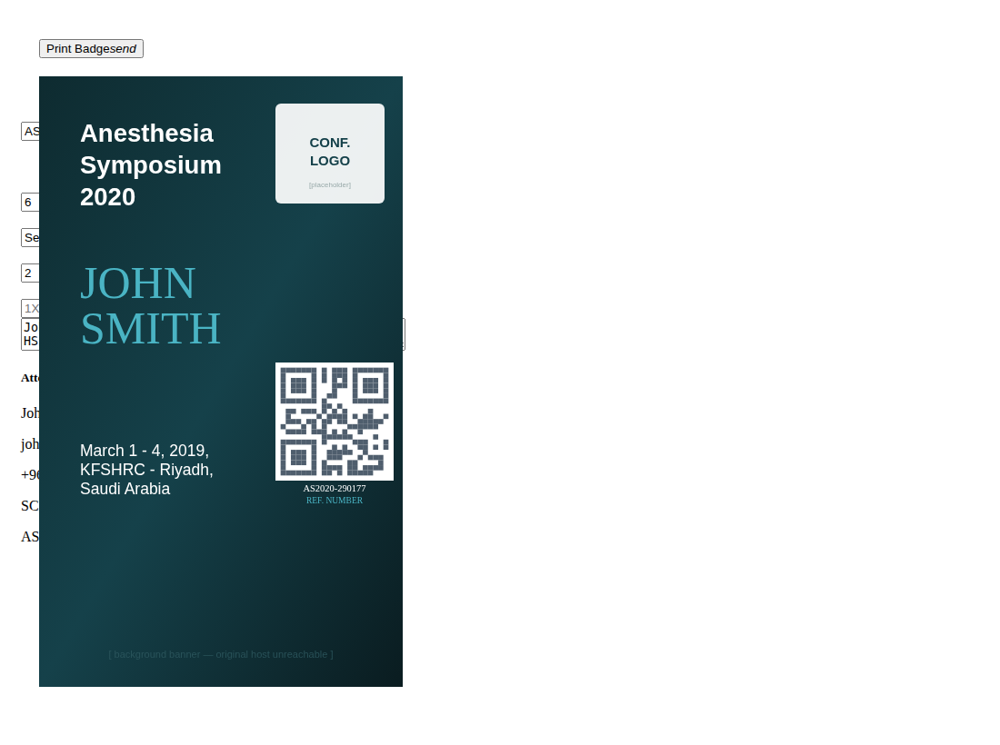
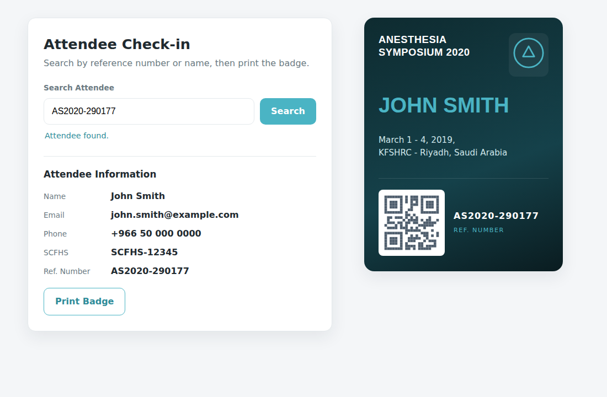
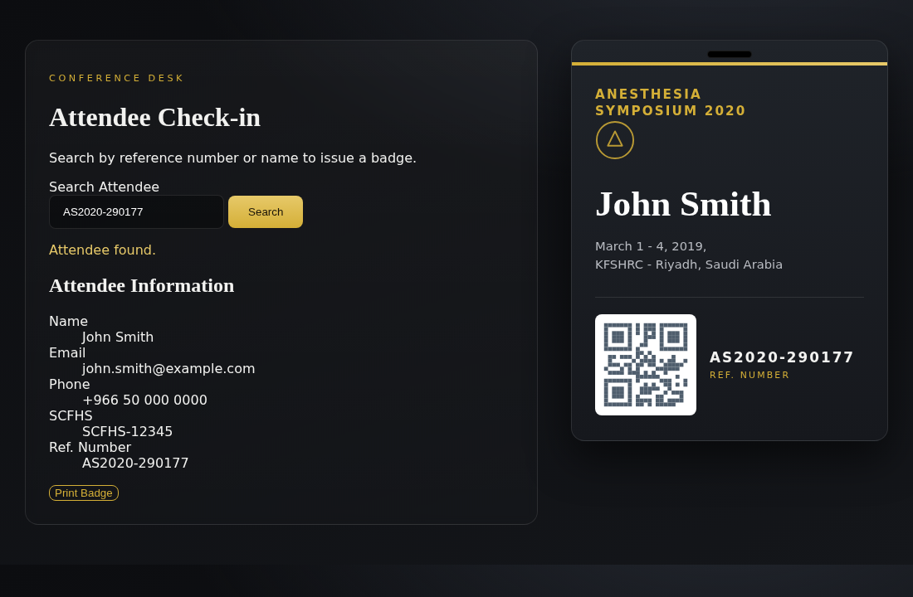

# Legacy Badge / Check-in Page — Review & Rebuild

This folder contains a review of a ~10-year-old single-file HTML/CSS/JS page and a
modern rebuild of it.

## What the page actually is

It is an **event badge / attendee check-in tool**. Originally it ran inside **Google
Apps Script** (Google Sheets): you type an attendee's reference number, it looks the
person up in a Sheet via `google.script.run`, then renders a printable conference
badge (name, event, QR code, reference number) and prints it.

Because it depends on the Google Apps Script host, the original **cannot run in a
plain browser** — `google.script.run` is `undefined` outside Google, so the **Search**
button throws there. That is by design for Apps Script, not a bug.

---

## 1. How it looks (rendered output)



`preview/mock-preview.html` is the original (with the one bug fixed) plus a small stub
that fakes the Google backend with a sample attendee, so the badge renders in any
browser. `preview/screenshot.png` is that page captured with Playwright.

Notes on the screenshot:
- The teal badge sits on top of the search form because the original CSS uses
  `position: fixed` on `.ticket-section` — a real layout quirk of the legacy code,
  left exactly as-is.
- The **background banner, conference logo, and QR code load from external hosts that
  are no longer reachable** (and the Google Charts QR API was **retired by Google in
  2024**). The screenshot therefore uses clearly-labelled local placeholders for those
  three images; everything else — structure, fonts, colours, text — is the genuine
  legacy output.

---

## 2. Strict bug-fix of the original

| File | What it is |
|------|------------|
| `original/index.html` | Your code, verbatim — the untouched reference. |
| `original/index.fixed.html` | The **only** functional fix applied; nothing else changed (same text, spelling, layout, CSS, Apps Script calls, QR URL). |

The single page-breaking bug is in `printBadge()` — the **Print Badge** button:

```js
// BEFORE (broken)
var printArea = document.getElementById('printArea').html; // .html is not a property → undefined
w = window.open();
w.document.write($(printArea).html());                     // writes from `undefined` → blank window
w.print();
w.close();

// AFTER (fixed)
var printArea = document.getElementById('printArea').innerHTML;
w = window.open();
w.document.write(printArea);
w.document.close();   // finish the document before printing
w.focus();
w.print();
w.close();
```

### Issues found — and what was done

> "Fixed in strict version" follows your instruction: **only** fix code errors that stop
> the page or its buttons from working; change nothing else.

| # | Location | Issue | Effect | Fixed in strict version? |
|---|----------|-------|--------|--------------------------|
| 1 | `printBadge()` | `document.getElementById('printArea').html` — `.html` is not a DOM property (returns `undefined`). | The **Print Badge** button opens a blank print window. | **Yes** → use `.innerHTML`. |
| 2 | `printBadge()` | `$(printArea).html()` runs on that `undefined` value (and would otherwise *unwrap* the element, returning only its inner content). | Even with #1 fixed, the printout would be empty/wrong. | **Yes** → write the `innerHTML` string directly. |
| 3 | `printBadge()` | `w.print(); w.close();` fire before the new window's document is finished. | Print can trigger on a blank page / the window closes too early. | **Yes** → add `w.document.close(); w.focus();` before printing. |
| 4 | `google.script.run …` | Needs the Google Apps Script host; `google` is undefined in a normal browser. | **Search** throws outside Google (works when deployed in Apps Script). | **No** — intended architecture, not a code error. Mocked only for the preview. |
| 5 | `.row` grid | Materialize columns add up to `s12 + s3 + s1 + s1 + s1 + s1 = 19` (max is 12). | Inputs wrap untidily; layout looks off. | **No** — cosmetic; the page still runs. |
| 6 | `<textarea … "Search Result"class=…>` | Missing space between two attributes. | HTML parse-error, but browsers recover and render fine. | **No** — non-breaking. |
| 7 | `<label for="txt2"></label>` | Empty label element. | No visible or functional effect. | **No** — non-breaking. |
| 8 | QR `chart.googleapis.com/chart?…` | Google Image Charts API was **retired in 2024**. | The QR code no longer loads. | **No** in the strict version (kept as-is); **replaced** with a working QR service in the proposals. |
| 9 | `.ticket-section` | `position: fixed` makes the badge overlap the search form. | Visual overlap. | **No** — cosmetic; preserved deliberately. |
| 10 | `runBadge()` | Renders on a fixed `setTimeout(…, 4000)` and parses fields with `split`/`splice`. | Works, but fragile (always waits 4s; brittle parsing). | **No** — works as written; improved in the proposals. |

---

## 3. Rebuilt version — two proposals

Both are **standalone front-end** (no Google dependency): attendee data lives in
`data.js` as a plain array you could later swap for a `fetch()` to a real API. Both keep
the **same on-badge wording** as the original (event title, dates/location,
"Ref. Number", the attendee fields). They differ in **both design and tech stack**.

Shared improvements over the legacy page:
- CSS/JS split into separate files; real `<label>`s and ARIA live regions.
- Responsive layout (no 12-column overflow, no `position: fixed` overlap).
- Search renders **immediately** via a direct lookup — no 4-second `setTimeout`.
- Reliable printing via a dedicated `@media print` stylesheet (prints just the badge).
- A **working** QR code (`api.qrserver.com`) instead of the retired Google Charts API.

### Proposal A — modern light, zero-framework
`proposal-a/` · `index.html` + `styles.css` + `app.js` + `data.js`
Clean light UI on hand-written CSS (no framework), with a dark teal badge that echoes
the original's `#4AB4C4` accent.



### Proposal B — premium dark, Tailwind stack
`proposal-b/` · `index.html` + `styles.css` + `app.js` + `data.js`
A different look **and** a different stack: a dark, gold-accented "premium" treatment
built on **Tailwind CSS (CDN)** with a small self-sufficient theme layer.



> The Proposal B screenshot was captured in a build sandbox where the Tailwind CDN is
> blocked, so its form area uses the CSS fallback layer; open `proposal-b/index.html` in
> a browser with internet access to see the full Tailwind layout. The badge itself is
> styled by `styles.css` and renders identically either way.

---

## How to view everything

- **Rendered legacy output:** open `preview/mock-preview.html`, or look at
  `preview/screenshot.png`.
- **Strict-fixed original:** `original/index.fixed.html` (needs Google Apps Script to do
  a real lookup; use `mock-preview.html` to see it render standalone).
- **Proposals:** open `proposal-a/index.html` and `proposal-b/index.html` directly in a
  browser — type a reference (`AS2020-290177`, `…178`, `…179`) or a name, then
  **Print Badge**.

### Regenerating the screenshots
`preview/screenshot.js` (and the offline render helpers) drive Playwright:

```bash
PLAYWRIGHT_BROWSERS_PATH=/opt/pw-browsers NODE_PATH=/opt/node22/lib/node_modules \
  node preview/screenshot.js
```
